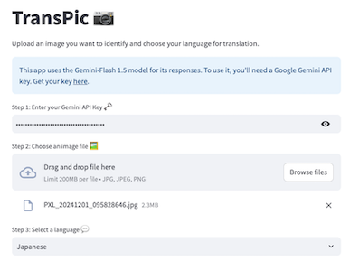
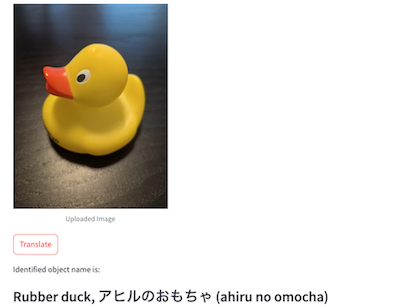

## Hi there! 👋

I’m Miki, a Full-Stack Developer based in London, UK. 🇬🇧 
I have a mix of experience in tech, sales and marketing, which helps me uncover insights, solve problems and create user-friendly software.

🎓 Master’s Graduate in Computer Science from the UK
 
🧳 5 years of experience in sales and business development at a travel agency in Japan
 
📈 2 years of experience in web content management and customer support at a marketing company in the UK

I’m now looking for opportunities in tech where I can apply my skills and experience to make a real impact! 💪 I’m especially passionate about the potential of generative AI and large language models and exploring their integration into innovative projects! 

### What I Work With

	• Frontend: JavaScript, TypeScript, React, Next.js, HTML, CSS, Flutter
	• Backend: Python, Node.js, FastAPI, Langchain
	• Other Tools: Docker, Cloudflare, Supabase, SQL(PostgreSQL, Oracle, etc.)

Check out my portfolio [here](https://mikistation.com/) 👀

## Featured Projects

### [Transpic](https://transpic.streamlit.app/)
Transpic is a **visual translation app** for language learners and travellers. It helps you identify objects like food, animals, and plants, and learn their names in your preferred language. Transpic makes language learning more intuitive and your travel experiences more fun!

    • Feature: image-to-text translation using AI model
    • Technology: Python, Streamlit, Gemini API

 

### [Swarm Fitbit App](https://github.com/3miki/swarm-fitbit-alarm)
Swarm is a **smartwatch app** that allows users to trigger a **discreet alarm to notify emergency contacts** such as family members or friends, in case of danger. With just a press of a button, the app sends an SMS with the user’s GPS location and a Google Maps link for quick assistance.

    • Feature: SMS notification with GPS location
    • Technology: JavaScript, Node.js, Express, Fitbit SDK, Twilio API

### [Ryoko History](https://github.com/ben-xD/ryoko-history) - Won 3rd place at AI Hackathon
Ryoko History is an **AI video storyteller** bridges language barriers to help users share travel stories effortlessly. Users can upload photos and chat with a conversational AI agent to share their travel experiences, which are then transformed into translated videos. 
 
The app leverages advanced AI technologies including conversational AI and text-to-speech ([Elevenlabs](https://elevenlabs.io/)), image-to-video ([Luma AI](https://lumalabs.ai/)), and GPT-4 ([Open AI](https://openai.com/)) models to deliver immersive storytelling with engaging visuals and narrated translations. 
 
I contributed to the backend, integrating APIs to bring these features to life!

	• Features: Story summarisation, translation, text-to-speech narration, image-to-video processing
	• Technologies: Python, FastAPI, asyncio, AI model APIs

